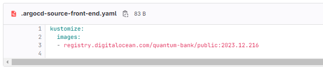

# Doc for the Web Project 

Few things to understand (this is a full automation process):

To achieve this automation process on the `Web` project, it required me to use 2 Branches `main` and `develop`, I have used `GitLab-CI` and `ArgoCD Image Updater` for this automation.

## First Understand GitLab-CI

The Gitlab-CI is used on the `main` branch, every time we push any changes, it `triggers` the pipeline.

The pipeline consists of `two stages`:

The first stage is named as `code-build` stage:

In this stage, the code builds with the provided commands. 

I have used `node:20.10.0` docker image in this stage and then installed the `yarn 4` then used `yarn prod:web` command to run the code. And the `dist` folder is passed to 2nd stage.

And, the second stage is named as `image-build-and-push` stage:

In this stage, I have used docker commands, similar to `publish.sh` file but changed and added a few details.

Firstly we `login` into the `DigitalOcean registry` then we `build` a docker image using the Dockerfile at apps/frontend/web/src/docker/ folder.

Then I gave a `tag` to this image which is `registry.digitalocean.com/quantum-bank/public:$(date +%Y.%m.$CI_CONCURRENT_ID)`.

Here `%Y` represents the `year` and `%m` represents the `month` and `$CI_CONCURRENT_ID` is representing a `unique ID` of build execution, e.g.

This way we can distinguish the docker images based on tags.

## Understand the ArgoCD Image Updater

The Argo CD Image Updater can check for `new versions` of the container images that are deployed with your `Kubernetes` workloads and `automatically update` them to their latest allowed version using Argo CD. 

I have implemented ArgoCD Image Updater on the `develop` branch. 

`What ArgoCD Image Updater is doing` here is that whenever ArgoCD Image Updater finds a new docker image version, `it updates the image tag on the GitLab` like this in the photo:

That is why I asked you for a new `GitLab token with write access`.

So `The reason why I did not set this on the main branch` is that if I had set up this on the main branch, then what would have happened is:

When you `push your code on the main branch` the `pipeline will get triggered` and `a new docker image will be pushed to the DigitalOcean registry`. 
ArgoCD Image Updater will `detect this new docker image` and it will perform an update operation. It `will update the image tag on the main branch`, and `now the pipeline will be triggered again` because `this update operation will create a commit on the main branch` and then a new docker image will be pushed to the DigitalOcean registry and then again the ArgoCD Image Updater will detect this new docker image and it will perform an update operation and this will trigger the pipeline again and again same will happen. This `will create a never-ending cycle`. 

So `as a solution` to this, I have used `2 branches`.

`ArgoCD` is monitoring the `develop branch`.

And the pipeline which is `building new docker images` is on the `main branch`.

